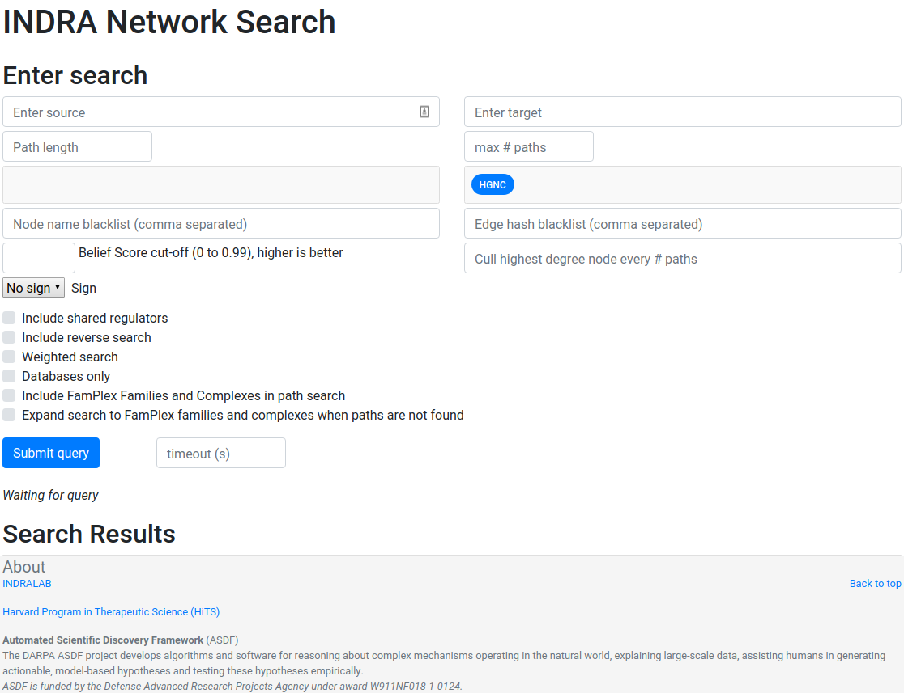
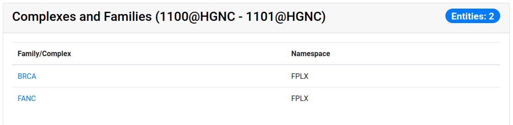

=====================
Network Search Web UI
=====================
This documentation introduces the web user interface for the INDRA Network
Search Service.

  *The network search interface with no input or results.*

The Graphs Used
---------------
The multiple graphs used for the network search is assembled from a full
snapshot of the `INDRA DataBase <https://github.com/indralab/indra_db>`_ and
is updated regularly. Each statement that includes two or three agents are
assembled into the support for the edges for the graphs with one edge
possibly containing multiple statements. There are three graph types used:

1. DiGraph
2. signed edge DiGraph
3. signed node DiGraph

The **DiGraph** is used for unsigned causal search and for assembling the
statement data supporting the results of the search while the **signed node
graph** is used for signed causal search and the **signed edge graph** is
used for assembling the statement data supporting the signed node search
results.

The edges in the signed edge graphs only contain statements that have clear
up- or downreguations associated with them, which currently is
`IncreaseAmount` and `Activation` for upregulation, and `DecreaseAmount` and
`Inhibition` for downregulation.

The code assembling the graphs can be found in `net_functions.py
<https://github.com/indralab/depmap_analysis/blob/master/depmap_analysis
/network_functions/net_functions.py>`_ in the function
`sif_dump_df_to_digraph()`.

Search Options
--------------

Source and Target
~~~~~~~~~~~~~~~~~
At least one of source and target is mandatory for the search. The source
and target are the nodes between which to find a path. Source and target does
not have to be of the allowed namespaces (see below). If no result is found
initially, grounding is done on the service backend to try to find an
alternative name for the provided node name. If only one of source or target
is provided, an open ended breadth first search is done instead if a path
search.

Path Length
~~~~~~~~~~~
The path length to search for. Should be a positive integer. For the purpose
of this search interface, the path length is defined here as the number of
edges between the source and the target.

Max # Paths
~~~~~~~~~~~
The maximum number of results to return per category in the results. The
default and the maximum allowed is 50 results.

Allowed Node Namespaces
~~~~~~~~~~~~~~~~~~~~~~~
The namespaces included here are the ones that are allowed on any node
visited in the path search. The namespace of the source and target are
excluded from this restriction. A namespace in INDRA is the type of
identifier used to uniquely identify an entity. For example, a chemical can
be identified using a `CHEBI` identifier and would then be identified in the
`CHEBI` namespace.

Open Search Options
~~~~~~~~~~~~~~~~~~~
Options under the Open Search Options are only applied during open ended
searches. In order to perform an open ended search, only a source or a
target must be given.

- **Terminal Namespaces:** Namespaces selected here restrict the search to
  only return paths that end (open search from source) or start (open
  search from target) on the given namespaces.
- **Max per node:** The integer provided here gives a maximum for the number
  of children to continue to open search from. This option is only applied
  during *unweighted* searches.

Context Options
~~~~~~~~~~~~~~~
The context based search allows a search to prioritize or only include
connections that are relevant to the provided context. The context is
given as MeSH terms.

- **MeSH IDs:** Enter a comma separated list of MeSH IDs that should be
  prioritized in the search.
- **Strict Filtering on MeSH IDs:** Tick this box to *only* allow edges with
  associated with the provided MeSH IDs. If left unticked, the search is
  weighted.
- **Constants** :math:`C` **and** :math:`T_k`: These two constant allow for
  changing the importance of the context in a weighted context based search.
  For any edge :math:`e`, the weight :math:`w_e` for context based search is
  calculated in the following way:

.. math::
    w_e = -C \cdot \log\left(\frac{\text{refcount}}{\text{total} + T_k}\right)

Here, `refcount` is the number of references with the associated MeSH
ID(s) that are supporting edge :math:`e` and `total` is the total number of
references supporting edge :math:`e`.

Statement Types to *Exclude*
~~~~~~~~~~~~~~~~~~~~~~~~~~~~
This is a multiselect dropdown which contains multiple statement type names
to exclude from the results. If an edge of a path only contain statement
types that are excluded, the whole path will be skipped from the result.

Node Name Blacklist
~~~~~~~~~~~~~~~~~~~
Node names entered here are skipped in the path search. This is a good way
to avoid nodes of extremely high degree that overwhelms the results and
effectively blocks out results including lower degree nodes. *See also Cull
Highest Degree Node below.*

Edge Hash Blacklist
~~~~~~~~~~~~~~~~~~~
To ignore a specific statement supporting an edge, the statement hash for
that statement can be added here.

Belief Score cut-off
~~~~~~~~~~~~~~~~~~~~
This option enables a belief score cut-off so that statements supporting an
egde has to have a belief score above this threshold. It is set to zero by
default. Read more about belief scores in the `belief module
<https://indra.readthedocs.io/en/latest/modules/belief/index.html>`_ of
INDRA.

Cull Highest Degree Node
~~~~~~~~~~~~~~~~~~~~~~~~
Entering an integer N here allows the path search to include the highest
degree node for the first N returned paths, after which it is added to the
**Node Name Blacklist**. This is repeated for the second highest degree node
for the following N paths, then for the third highest degree node and so
forth. *Note:* This option is currently only applied for unsigned path
searches.

Signed Search
~~~~~~~~~~~~~
To perform a signed search, click on the drop down menu that says "No sign"
and chose a sign. "+" means that all the returned paths are upregulations,
and "-" means that all the returned paths are downregulations. For the
purpose of signed search, only statements that imply a clear up- or
downregulation are considered. Currently this mean `IncreaseAmount` and
`Activation` for upregulation, and `DecreaseAmount` and `Inhibition` for
downregulation.

Include Shared Regulators
~~~~~~~~~~~~~~~~~~~~~~~~~
This checkbox adds results from a search of direct common shared regulators
of source and target. A direct shared regulator is defined as any node that
is exactly one edge upstream of *both* source and target.

Include Reverse Search
~~~~~~~~~~~~~~~~~~~~~~
With this option, the reverse search *from* target *to* source is done as
well as the original search from source to target. If the timeout is reached
(see below) before the reverse seach can start, the reverse search will
not return any paths. If the timeout is reached during the reverse search,
fewer paths than for the original search will be retured.

Weighted Search
~~~~~~~~~~~~~~~
When performing a weighted search, the cost along every path encountered is
calculated as the sum of the weights along the path. The paths are then
returned in ascending order of cost. The weighted search uses a slightly
modified version of the Djikstra weighted search employed in Networkx.
*Note:* A weighted search is costly and usually takes longer than
a normal search. It is common that a very heavy weighted search times out,
especially for a *signed* weighted search.

The code implemented for the weighted search is available on `github
<https://github.com/sorgerlab/indra/blob/master/indra/explanation/pathfinding/pathfinding.py>`_
in the function `shortest_simple_paths()`.

Databases Only
~~~~~~~~~~~~~~
With this option, only statements that contain sources from curated
databases like PathwayCommons and Signor are allowed to support edges in the
returned paths.

Include Famplex Families and Complexes in Path Search
~~~~~~~~~~~~~~~~~~~~~~~~~~~~~~~~~~~~~~~~~~~~~~~~~~~~~
This option allows for edges to be between a gene and its family or
betewen a gene and a complex formed by its encoded protein. For example: an
edge between `BRCA1` and its family `BRCA` would be allowed.

Expand search to FamPlex
~~~~~~~~~~~~~~~~~~~~~~~~
If a path search returns empty, this option will allow the path search to be
retried with parents if the source and/or target entities. For example, if a
search with `BRCA1` as source returns empty, the search would be retried
with the `BRCA` family as source instead.

Timeout
~~~~~~~
Setting a timeout allows to set a larger (or smaller) timeout than the
default 30 seconds timeout. The time since the path search was started is
checked after each path has been checked during the search. If the time
passed is larger than the allowed timeout, the search is interrupted and
returns as fast as possible. The timeout provided has to be a decimal number
smaller than or equal to 120 seconds.

Result Categories
-----------------
If there are no results for the specific section, that section's card won't
show up. By default, the result cards are collapsed and only the card header
is shown with a summary count of the number of results. To expand the card
body, click on the card header.

Complexes and Families
~~~~~~~~~~~~~~~~~~~~~~
This card shows the results of a search for common complexes and families
between source and target. For example with `BRCA1` and `BRCA2` as source
and target, respectively, the BRCA family would show up alongside the FANC
family.

  *The result of a search with `BRCA1` and `BRCA2` as source and target,
  respectively for Complexes and Families.*

Common Targets
~~~~~~~~~~~~~~
This card shows the direct downstream targets that are common to both the
chosen `source` and `target`.

Shared Regulators
~~~~~~~~~~~~~~~~~
Shared regulators are only searched for if the corresponding tick-box is
checked. The results shown are the direct upstream regulators that are
common to both `source` and `target`.

N Edge Paths
~~~~~~~~~~~~
These card are shown per path length so that all paths with one edge are
assembled under one card, all paths with two edges in another card and so
forth.

Detailed Results
----------------
For each result card, the edges displayed link out to an INDRA DataBase query
in order to further inspect the results. As the network search results are
filtered in more detail than what is possible using the INDRA DataBase web
interface, the statements shown can sometimes be slightly different than the
edge data returned by the network search result.

Download Results
----------------
You can download the search result json and the statement jsons from the *path
search* by clicking the link provided after the search has resolved.
